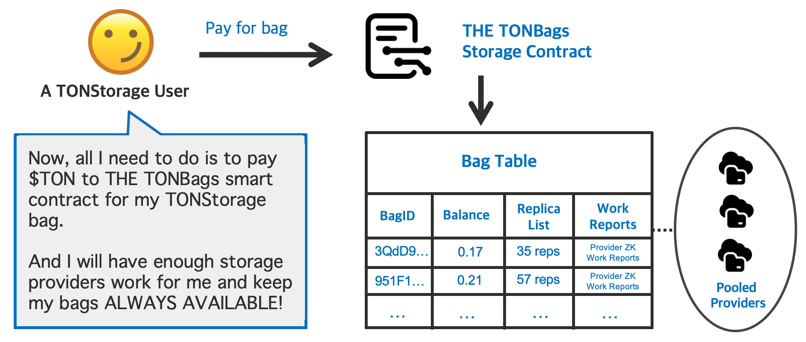
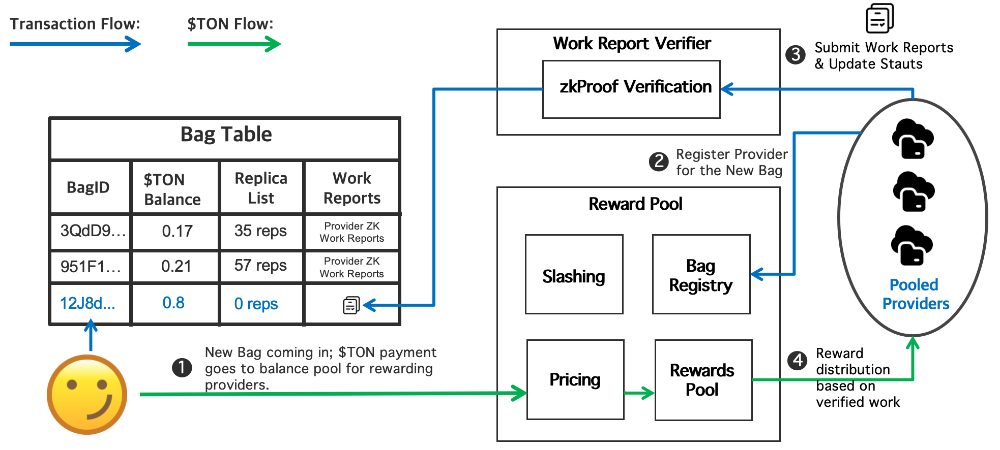

## I. Crust Network TONBags storage

Crust Network stands as one of the world’s largest decentralized storage networks. Over the past two years, we’ve successfully launched our Mainnet, boasting an impressive 600PB of storage across 1500+ nodes. Our network has facilitated storage for over 2 million orders, serving a diverse user base of 100,000+ individuals and establishing partnerships with more than 150 businesses. To further enhance Crust Network’s storage capabilities, we’ve already developed storage protocols for both the EVM and Algorand ecosystems.

**Introducing TONBags: On-Chain TONStorage Marketplace**

TONStorage is a fundamental component of the TON ecosystem. It enables users to store and distribute files of any size on a decentralized TON network. While it’s currently open and available for use, there are some limitations. Specifically, TONStorage users must manually identify reliable storage providers and create redundancy strategies to ensure better availability and failover. This process can be cumbersome.

Enter TONBags—an innovative solution. TONBags serves as an on-chain marketplace, simplifying storage discovery for users. With TONBags, everyone gains direct and effective access to TONStorage, making decentralized storage more accessible and user-friendly.

## II. TONBags storage protocol

### User flow

TONBags provides a unified storage interface via TONBags storage contract. And storage providers are incentivized to participate in the TON network by leveraging the [TON storage daemon](https://docs.ton.org/participate/ton-storage/storage-daemon).

The user flow within TONBags is straightforward:

1. Users call the TONBags storage contract, and pay a storage fee in $TON to place storage orders for their TONStorage files (referred to as bags).
2. Storage providers monitor these orders and store replicas of the files. To receive storage fees, providers periodically submit work reports (also known as storage proofs) to the TONBags storage contract.

### TONBags storage contract

[TONBags storage contract](https://github.com/crustio/tonbags-contract) is a suite of open-source TON smart contracts developed and deployed by Crust Network. It provides interface for users to place storage orders for their files (*bags*), and for storage providers to monitor and discover orders for storage. It also consists of a Work Report Verifier to verify ZK storage proofs submitted by storage providers, and a Reward Pool to distribute storage fees to storage providers in a linearly and fairly manner.

### Storage providers 

To participate as storage providers:
- Run the [TONBags manager](https://github.com/crustio/tonbags-manager) to handle storage orders and submit work reports.
- Maintain a local [TON storage daemon](https://docs.ton.org/participate/ton-storage/storage-daemon) node for efficient data propagation across the TON network.