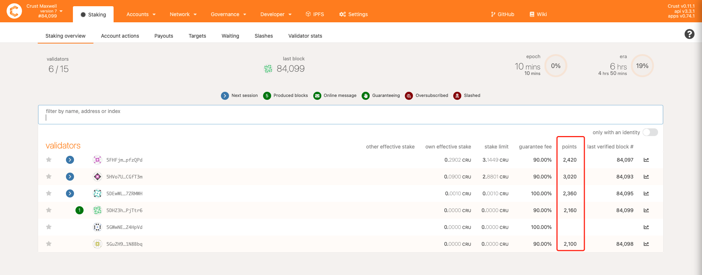

## Overview

The validator is the node that validates transactions and generates blocks in Crust Network, also maintaining the security of Crust Network. Under the GPoS (Guaranteed Proof of Stake) consensus of Crust Network, validator nodes obtain rewards via staking and block generation.

## Validators’ Rewards and Slash

> Currently, Crust Network is at the preview network stage - Maxwell. Therefore, the following reward and punishment specifications concern only rules and parameters pertaining to Maxwell.

### 1.Rewards

The rewards of validators are composed of two parts: **authoring rewards and staking rewards**. Normally, validators will receive both the authoring and staking rewards, while candidates receive only staking rewards.

#### Authoring rewards

Authoring rewards are the incomes obtained by validators participating in block generation and transaction packaging in Crust Network. The incomes are related to staking points.



**In Maxwell, each Era (6 hours) generates a total authoring rewards of 150 CRUs, which gets halved every 90 days.** And the authoring rewards for each validator in each Era are calculated as:

```shell
authoring_rewards = total_authoring_rewards * point_ratio (individual_points / total_points)
```

A new round of validator election will conducted in each era, and the next validator of the era will be selected from all candidates and validators. The rule for the election is:

```shell
Electing from high to low according to effective stake 
```

#### Staking rewards

Staking rewards refer to the validators or candidates who hold storage resources obtaining incomes through staking CRUs. The staking income is related to the following factors:

- Stake Limit: The Stake Limit determines the upper limit of the effective stake of CRUs by the validator, which is directly related to the amount of storage provided by the validator. In Maxwell, a 1TB SRD file corresponds to an upper limit of 1CRU, and a meaningful file corresponds to 1-5 times the upper limit of SRD, with specific "times" related to the number of duplicates of meaningful files. For details, please refer to [DSM Guidance](DSM.md);
- Effective Stake: The Effective Stake is **the amount of staking that actually generates incomes**, which is related to the stake limit of the validator that is guaranteed. An example will be provided later.
- Guarantee fee: Guarantee fee is the ratio of the share to guarantors. The larger the value, the higher the guarantor’s income.

> If a validator obtains a staking income of 1000 CRUs and has his own staking share accounting for 90% of the total stake (the other 10% is the guarantor’s share). If the validator sets the guarantee fee at 95%, then the guarantor will get a total of 95 CRUs (1000 * 10% * 95% =95), with the remaining 5 CRUs going to the node.

How are the rewards specifically distributed? **First, in Maxwell, each Era (6 hours) will generate a staking reward of 600 CRUs, which gets halved every 90 days.** The income obtained by the validator and candidate is calculated as following steps:

```shell
validator_total_staking_amount = self_staking_amount + guarantee_amount
```

```shell
validator_effective_staking_amount = MIN (stake_limit, validator_total_staking_amount) * (self_staking_amount / validator_total_staking_amount)
```

```shell
guarantor_effective_staking_amount = MIN (staking_limit, validator_total_staking_amount) * (guarantee_amount / validator_total_staking_amount)
```

```shell
validator_rewards = total_staking_rewards * validator_effective_staking_amount / total_effective_staking_amount + total_staking_rewards * guarantor_effective_staking_amount / total_effective_staking_amount * (1 - guarantee_fee)
```

The following is an example:

If node A staked 1000 CRUs itself, and was guaranteed with 200 CRUs. The staking upper limit is 1000 CRUs, with the guarantee fee set at 95%, and the staking income generated per round is 600 CRUs. Supposing the effective staking amount of the network is 2000 CRUs, we can work out the income of each Era:

1. Validator's effective staking amount = MIN（1000， 1200）*（1000 / 1200） = 1000 * （1000 / 1200） = 833.3 CRU
2. Guarantor's effective staking amount = MIN（1000，1200）* （200 / 1200）= 1000 * （200 / 1200） = 166.66 CRU
3. Validator's rewards = 600 * （833.3 / 2000） + 600 * （166.66 / 2000） * 5% = 252.49

### 2. Slash

Only validators (block generators) and the nodes that actually package blocks and transactions will got slashing. It should be noted that:

1. Conditions for slash

- At the end of each Session (10 minutes), an examination will be performed to detect whether validators are offline. Once validators are found to be offline, the slash mechanism will be triggered to calculate the slashing amount;
- Each time a block is generated, the packager (block author) of the block will be checked on double authoring. If it is detected that the packager attempted to generate two different blocks out of the same block height, a slash will be imposed on him.

2. Consequence of slash

The staked CRUs will be deducted according to the slash ratio, and the validator himself will be revoked the entitlement. The validator in the state of slash will lose the guaranteed part before him being slashed.

3. Slash ratio

The slashing amount is the maximum slash ratio that occurs in a SlashingSpan multiplied by the validator’s number of valid votes:

```shell
slash_ratio = min((3 * (k - (n / 10 + 1))) / n, 1) * 0.07
```

where **k is the number of offline validators and n is the overall number of validators (for block authoring).** A 10% offline triggers 0% slash which however can climb linearly up to the maximum of 7%. When one-third of the validators are offline, the slash ratio is approximately 5%.

4. Deduction time point for slash

The slash will not take place instantly, rather, a delayed deduction comes after 28 Eras (7 days). A slash that does not actually occur can be cancelled (applicable through the Treasury).

## To become a validator

To become a validator of Crust Network requires you to have a certain amount of storage resources, a high-quality network, as well as configured nodes ready.

Currently, you can join the Maxwell to become a validator. For details, please refer to the description of validators (nodes) in [Maxwell Overview](preview-network-maxwell.md).
