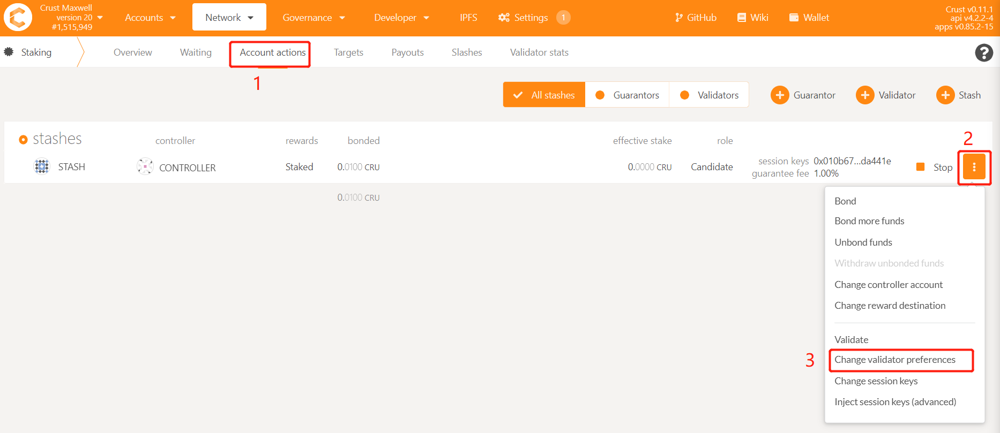
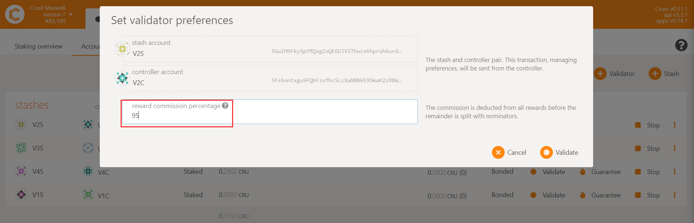

The validator is the basic unit of the Crust Network. Refer to this document to become a validator of Crust Network.

## 0. Preparation

You need to ensure that you have enough CRUs for sending transactions. You can claim your CRU from Ethereum [Claim to Maxwell](claims.md).

## 1. Bond Accounts
Make sure you have completed [Account Configuration](new-bond.md), and have bonded your stash and controller accounts.

## 2. Setup Crust Nodes
Refer to [Node Overview](node-overview.md) to setup your nodes.

## 3. Increase or Decrease the Amount of Self-staked Token

You can change your self-staked token amount in [APPS](https://apps.crust.network). 

## 4. Set Guarantee Fee

The guarantee fee set by the validator refers to the **the percentage of total income (staking income + block generation income) which will be distributed to the guarantor**. 

> For example, if the validator obtains 900 CRU staking rewards and 100 CRU block generation reward in one era, and if his self-staking accounts for 90% of his total staking(The remaining 10% is contributed by guarantors). If the guarantee fee is 95%, then the guarantors finally obtains (900 + 100) * 10% * 95% = 95 CRUs income, and the remaining 905 CRUs belongs to the validator.

