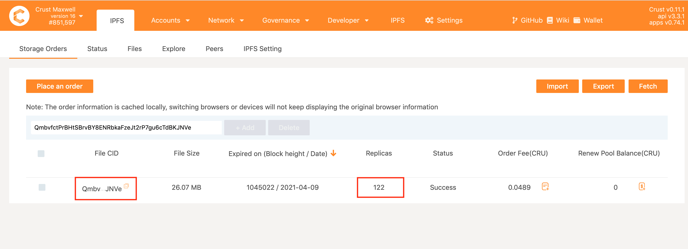

## Overview

Hosting a website/DApp frontend on IPFS grants you several benefits, such as maintaining serverless, potentially resilient to DNS hijacks (together with IPNS/ENS), and achieving high availability. [Uniswap](https://app.uniswap.org), as one of the most widely used DEX (Decentralized Exchange), has been using IPFS for approximately a year. This Uniswap [blog](https://uniswap.org/blog/ipfs-uniswap-interface/?fileGuid=4UPQCRowpX8i8Gzj) also touches upon some aspects of IPFS integration.

As a decentralized application, Uniswap does have a demand to decentralize its interface hosting. By integrating IPFS, Uniswap to a certain extent can achieve decentralization. IPFS is great for getting started to use content addressing for all sorts of distributed web applications. But for the majority of these cases:

* Data is provided by the user's own nodes. Otherwise, a centralized pinning service or some peers must be there voluntarily/spontaneously storing data.
* Centralized IPFS pinning services must be trusted to do their work. IPFS brings no built-in provisions to verify that data is being stored and correctly provided by the pinning service.

As an innovative project, Uniswap has never ceased its steps towards technical exploration. Recently [**Uniswap**](https://app.uniswap.org) has enabled decentralized deployment of its frontend interface by integrating [Crust Network](https://crust.network) into its [release workflow](https://github.com/Uniswap/uniswap-interface/blob/main/.github/workflows/release.yaml). Integration with Crust enables the full decentralization of storage and distribution, disengaging from the dependence of centralized pinning services. For details, please see  [Decentralized Uniswap Interface Hosting on IPFS](https://medium.com/crustnetwork/decentralized-uniswap-interface-hosting-on-ipfs-18a78d1209ac).

## Decentralized deployment of Uniswap Interface

Uniswap integrates deploying steps into [a release workflow](https://github.com/Uniswap/uniswap-interface/blob/main/.github/workflows/release.yaml?fileGuid=4UPQCRowpX8i8Gzj), establishing a consistent and automated CI/CD pipeline. The process of the workflow is as following:

### Step 1. Build the Uniswap website

Uniswap builds the website, all the contents for the newest version of Uniswap interface should be contained in one **build folder**.

### Step 2 Upload the website to IPFS

Uniswap uploads the **build folder** via [Pinata](https://pinata.cloud/?fileGuid=4UPQCRowpX8i8Gzj) (an [IPFS pinning service](https://docs.ipfs.io/concepts/persistence/#pinning-services?fileGuid=4UPQCRowpX8i8Gzj)) onto IPFS network so that this file can be retrieved via IPFS.

### Step 3 Pin to IPFS

To decentralize the deployment workflow, Uniswap is using Pinata and[Crust Network](crust.network?fileGuid=4UPQCRowpX8i8Gzj)as its pinning services. Uniswap has added the following configurations to [`release.yaml`](https://github.com/Uniswap/uniswap-interface/blob/main/.github/workflows/release.yaml?fileGuid=4UPQCRowpX8i8Gzj):

```yaml
- name: Pin to Crust
uses: crustio/ipfs-crust-action@v1.0.8
continue-on-error: true
timeout-minutes: 2
with:
cid: ${{ steps.upload.outputs.hash }}
```

Whenever the Uniswap interface is updated, the corresponding deployment workflow will be automatically executed while triggering [Crust IPFS pin actions](https://github.com/marketplace/actions/crust-ipfs-pin?fileGuid=4UPQCRowpX8i8Gzj).

The [Crust IPFS pin action](https://github.com/marketplace/actions/crust-ipfs-pin?fileGuid=4UPQCRowpX8i8Gzj) helps place a storage order (an on-chain order contains IPFS CID of the website Build Folder) on Crust Network. Once this action is completed, the website build folder will be pinned and distributed by storage nodes of Crust Network. The order placement and file distribution are both decentralized.

When the storage order is generated, the storage info including status and the number of replicas can be collected on-chain and can be viewed via [Crust Apps](https://wiki.crust.network/docs/en/storageUserGuide#14-checking-order-status?fileGuid=4UPQCRowpX8i8Gzj).



From above, it can be seen that the Uniswap interface (with the CID **`QmbvfctPrBHtSBrvBY8ENRbkaFzeJt2rP7gu6cTdBKJNVe`**) is pinned by a total of 121 nodes in Crust Network.

### Step 4. Update DNS records

The DNS records of Uniswap interface makes the website accessible via a readable url `app.uniswap.org`. The DNS records are configured as follows:

* A CNAME record for `app.uniswap.org` with a value of cloudflare-ipfs.com.
* A TXT record for`_dnslink.app.uniswap.org`with a value of `dnslink=/ipfs/QmRELxvJy8rNA5EoCpYQkWKzxi5y1zCMmcM4UveBaNGuLo`

*As of this writing, the Content ID of Uniswap interface is **`QmRELxvJy8rNA5EoCpYQkWKzxi5y1zCMmcM4UveBaNGuLo`**, which may change once the Uniswap Interface updates.*

## A general workflow to decentralized host websites/DApps

Here is a general GitHub workflow that can guide developers to deploy a website/DApp decentralized: [IPFS Crust Pinner Template Workflow](https://github.com/crustio/ipfs-crust-pinner/blob/main/.github/workflows/template.yml?fileGuid=4UPQCRowpX8i8Gzj). With the [Workflow](https://github.com/crustio/ipfs-crust-pinner/blob/main/.github/workflows/template.yml?fileGuid=4UPQCRowpX8i8Gzj) combined, the whole deployment process is as follows (take website deployment as an example):

1. Build the website

    The same as the [build-step of Uniswap Interface](#step-1-build-the-uniswap-website?fileGuid=4UPQCRowpX8i8Gzj), and websites should be built into a **build folder**.

2. Upload the website to IPFS

    In this step, [Crust IPFS Upload Action](https://github.com/marketplace/actions/crust-ipfs-upload?fileGuid=4UPQCRowpX8i8Gzj) will be triggered.

    The website **build folder** will be uploaded onto a public IPFS Gateway - [crustwebsites.net](https://crustwebsites.net/ipfs/bafybeifx7yeb55armcsxwwitkymga5xf53dxiarykms3ygqic223w5sk3m#x-ipfs-companion-no-redirect?fileGuid=4UPQCRowpX8i8Gzj).

3. Pin to IPFS

    In this step, [Crust IPFS Pin Action](https://github.com/marketplace/actions/crust-ipfs-pin?fileGuid=4UPQCRowpX8i8Gzj) will be triggered. The website **build folder** will be pinned and distributed by storage nodes of Crust Network.

4. Update DNS records

    The DNS configuration is demonstrated in [this doc](https://docs.ipfs.io/how-to/websites-on-ipfs/link-a-domain/#domain-name-service-dns?fileGuid=4UPQCRowpX8i8Gzj). Also, there is a [standard Github workflow](https://github.com/crustio/ipfs-crust-pinner/blob/main/.github/workflows/DNSLink-template.yml?fileGuid=4UPQCRowpX8i8Gzj) to help automatically update the DNS Record of Cloudflare.

### To get more decentralization

Developers can integrate products such as Ethereum Name Service (ENS) to further decentralize their websites/DApps. This will make the website more secure, effectively avoid DNS hijacking.

## Resources

### Uniswap materials

* [Uniswap Interface + IPFS](https://uniswap.org/blog/ipfs-uniswap-interface/?fileGuid=4UPQCRowpX8i8Gzj)
* [Uniswap Interface](https://app.uniswap.org/#/?fileGuid=4UPQCRowpX8i8Gzj)
* [Uniswap Documents](https://uniswap.org/docs/v2/?fileGuid=4UPQCRowpX8i8Gzj)

### Crust Materials

Crust provides a decentralized storage network of Web 3.0 ecosystem.

* [Crust Network](https://crust.network?fileGuid=4UPQCRowpX8i8Gzj)
* [Crust IPFS Action](https://github.com/crustio/ipfs-crust-action?fileGuid=4UPQCRowpX8i8Gzj)
* [Crust IPFS Upload Action](https://github.com/crustio/ipfs-upload-action?fileGuid=4UPQCRowpX8i8Gzj)
* [IPFS Crust Pinner](https://github.com/crustio/ipfs-crust-pinner?fileGuid=4UPQCRowpX8i8Gzj)
* [A Demo of Website Hosting](https://github.com/crustio/crust-demo/tree/main/website-hosting-demo?fileGuid=4UPQCRowpX8i8Gzj)
